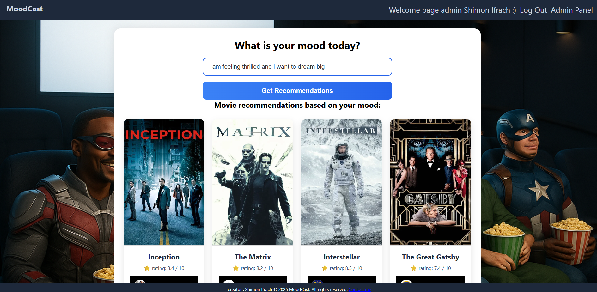

# 🎬 MoodCast — AI-Powered Movie Recommendations

**MoodCast** is a smart movie-recommendation Progressive Web App (PWA) that suggests films based on your current mood. 
Powered by AI and fully deployed to a live production environment, it integrates TMDB, Google OAuth, and **Stripe Checkout** to deliver a seamless cinematic experience.

---

## 🌟 Features (Production Ready)

- 🎭 **Mood-based movie suggestions** — Describe how you feel, and AI finds the perfect match.
- 🤖 **Google Gemini Integration** — Live connection to Google Gemini API for real-time mood analysis.
- 🎬 **TMDB API** — Fetches real-time metadata, high-quality posters, and ratings.
- 👤 **Google OAuth 2.0 (Live)** — Fully configured authentication working on a public domain.
- 💳 **Stripe Checkout (Live Integration)** — Secure payment handling with dynamic redirects.
- 📱 **Native Android Experience (PWA)** — Installable APK with a standalone interface, no browser bars, and custom splash screen.
- 🌀 **Cinematic Loading Engine** — Custom CSS3/JS animation featuring a pulsing logo and dynamic "flying" movie posters.

---

## 🛠️ Tech Stack & Deployment

### Backend & Frontend
- **Framework:** ASP.NET Web Forms (.NET Framework 4.7.2+)
- **Language:** C#
- **Frontend:** HTML5, CSS3 (Flexbox/Grid), JavaScript (ES6+)

### Mobile & PWA Infrastructure
- **App Packaging:** [PWABuilder](https://www.pwabuilder.com/) (TWA - Trusted Web Activity)
- **Asset Verification:** Digital Asset Links (`assetlinks.json`) for deep linking and native UI.
- **Client-Side Storage:** `sessionStorage` for optimized animation lifecycle management.

### Infrastructure & Cloud Services
- **Web Hosting:** [Somee.com](http://somee.com/) (Windows Server / IIS)
- **Database Cloud:** [Neon Tech](https://neon.tech/) (PostgreSQL)
- **Media & Image CDN:** [Cloudinary](https://cloudinary.com/) (High-performance image storage & optimization)

---

## 🚀 Getting Started

### 🔧 Prerequisites

| Tool                           | Purpose                                    |
|--------------------------------|--------------------------------------------|
| Visual Studio 2022+            | Build & run the project                    |
| PostgreSQL                     | Database for users & activity logs         |
| **PWABuilder CLI** | Convert Web App to Native Android APK/AAB  |
| API Keys                       | Google Gemini · TMDB · Google Cloud · Stripe · Cloudinary |

---

## 🖼️ App Preview

  
  
   
  <i>MoodCast - Finding the perfect film for your mood.</i>

---

## 🎥 Demo Video

▶️ **Watch the demo on YouTube** [MoodCast Demo Video](https://youtu.be/cRubk3rup4)

---

## 🧠 Credits & Acknowledgments

- **AI Engine:** [Google Gemini](https://ai.google.dev/) for mood-to-genre mapping.
- **Movie Data:** [TMDB API](https://www.themoviedb.org/) for the extensive film database.
- **Packaging:** [PWABuilder](https://www.pwabuilder.com/) by Microsoft.
- **Cloud Media:** [Cloudinary](https://cloudinary.com/) for lightning-fast poster delivery.
- **Design:** Branding assets and cinematic posters generated with AI.

---

## 📜 License

Released under the **MIT License**.
